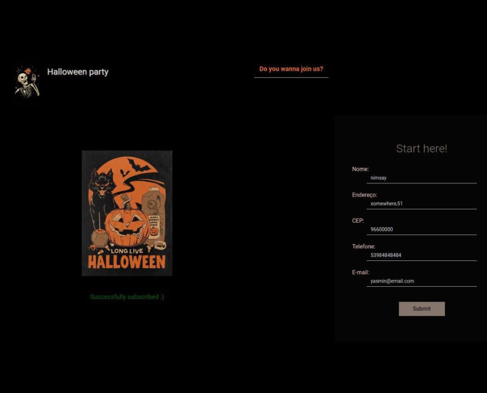

  <h1>HalloweenForm</h1>  
  
A simple form to join my hypothetical halloween party

  
  
  
You can check the page, and see it working <a href="https://yasminconstantino.github.io/HalloweenForm/">here</a>

  <h4> Languages and Technologies:</h4>
  

    
    
    
  

<section>
        <h2>Um Summary HTML5</h2>
        

            
Clique aqui para ler em português

            
Este é um formulário simples para se cadastrar na minha festa de Halloween ficticia.

            
Você pode acessar a página e ver ela funcionando <a href="https://yasminconstantino.github.io/HalloweenForm/">aqui</a>

            <h4>Linguagens e tecnologias utilizadas:</h4>
            

                
                
                
            

        

    </section>
